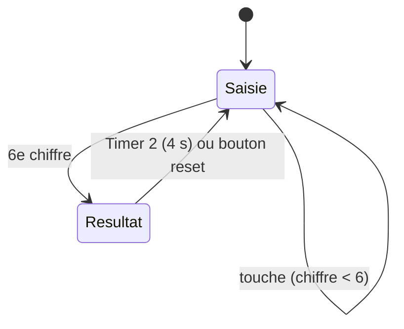

# Serrure électronique à code - STM32F103C6 en bare metal

Système de contrôle d'accès par code à 6 chiffres, réalisé **entièrement en bare metal** sur un STM32F103C6 : ni HAL, ni bibliothèque, seul `#include <stdint.h>` est utilisé. Tous les registres (RCC, GPIO, AFIO, EXTI, TIM2, SysTick, NVIC) sont définis et configurés à la main.

## Démonstration

<!-- Glisse ta vidéo .mp4 ici dans l'éditeur GitHub : le lien sera ajouté automatiquement -->

## Fonctionnement

1. L'utilisateur tape un code de 6 chiffres sur le clavier matriciel 4x3.
2. Chaque chiffre saisi s'affiche sur l'afficheur 7 segments.
3. Au 6e chiffre, le code est comparé au code secret :
   - **Code correct** : LED verte allumée et message d'accueil sur le LCD.
   - **Code erroné** : LED rouge, buzzer et message `CODE ERRONE !` sur le LCD.
4. Le système revient à l'état initial :
   - automatiquement après **4 secondes** (interruption du Timer 2),
   - ou **immédiatement** avec le bouton de reset (interruption externe EXTI sur PB7).



## Matériel

| Composant | Rôle |
|---|---|
| STM32F103C6 (8 MHz, horloge interne) | Microcontrôleur |
| LCD 16x2 (LM016L) | Messages, mode 4 bits |
| Afficheur 7 segments (cathode commune) | Chiffre saisi |
| Clavier matriciel 4x3 | Saisie du code |
| LED verte / LED rouge | Accès accordé / refusé |
| Buzzer + transistor 2N2222 + diode 1N4148 | Alarme |
| Bouton poussoir | Reset par interruption |

## Brochage

| Fonction | Broches |
|---|---|
| LCD D4 à D7 | PA0 à PA3 |
| LCD RS / EN | PA4 / PA5 (RW à la masse) |
| LED verte | PA8 |
| LED rouge | PA9 |
| Buzzer (via 2N2222) | PA10 |
| 7 segments a à g | PB0 à PB6 |
| Bouton reset | PB7 (EXTI7, pull-up interne) |
| Clavier, lignes | PB8 à PB11 (entrées pull-up) |
| Clavier, colonnes | PB12 à PB14 (sorties) |

## Périphériques utilisés

- **GPIO** : sorties push-pull, entrées avec pull-up
- **EXTI7 + NVIC** : interruption sur front descendant (bouton reset)
- **TIM2** : prescaler 7999, débordement avec interruption (délai de 4 s)
- **SysTick** : délais en millisecondes par scrutation (`delay_ms`)

## Choix de conception

Les interruptions sont **courtes** : elles lèvent seulement le drapeau `reset_demande`, et la boucle principale exécute `Reset_Systeme()`. Un premier essai appelait `delay_ms()` (donc SysTick) depuis l'interruption, ce qui figeait le programme.

Le prescaler de TIM2 est chargé immédiatement par `TIM2_EGR = 1`, sinon le premier délai est beaucoup trop court.

## Valeur de TIM2_ARR

| Contexte | `TIM2_ARR` |
|---|---|
| Carte réelle (8 MHz, temps réel) | `3999` (4 s) |
| Simulation Proteus (plus lente que le temps réel) | `2285` (valeur utilisée dans `main.c`) |

Dans Proteus, le champ **Clock Scale** du STM32 doit rester à `1 Times`, sinon tous les délais sont raccourcis.

## Simulation (Proteus)

1. Ouvrir le fichier de simulation.
2. Double-cliquer sur le STM32 et charger le `.hex` ou `.elf` dans **Program File**.
3. Vérifier la fréquence d'horloge (8 MHz) et le **Clock Scale**.
4. Pour le buzzer, régler **Operating Voltage** à une valeur inférieure ou égale à la tension d'alimentation.

Remarque : dans la simulation, les entrées du clavier doivent être reliées **sans résistance en série**. Avec des résistances de 220 ohms, le modèle Proteus ne lit pas les appuis.

## Documentation utilisée

Uniquement les documents officiels de STMicroelectronics et les fiches techniques des composants :

- Reference Manual RM0008 (STM32F101xx, F102xx, F103xx)
- Programming Manual PM0056 (STM32F10xxx Cortex-M3)
- Datasheet STM32F103x6
- Datasheets du LCD HD44780 (LM016L), de l'afficheur 7 segments et du clavier matriciel

## Structure du dépôt

```
main.c        Code source complet
README.md     Ce fichier
```

Le fichier de démarrage et le linker script sont ceux générés par STM32CubeIDE.

## Améliorations possibles

- Limiter le nombre d'essais avec blocage temporaire
- Code modifiable, sauvegardé en Flash
- Clavier géré par interruptions au lieu du balayage
- Remplacer les boucles d'attente par des interruptions SysTick

## Auteur

**Ait Lahcen Ayoub**
